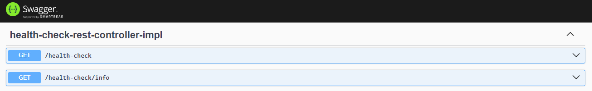

<h1 id="top" align="center">Micro <br/> Backend Service</h1> 

<br>

<div align="center">
    
</div>

## 🔍 Table of Contents

- [About Project](#intro)
- [Technologies](#technologies)
- [Features](#features)
- [Releases](#releases)
- [System Startup](#system-startup)
  - [Developer Mode](#developer-mode)
  - [Production Mode](#production-mode)
- [Endpoint Documentation](#endpoint-documentation)
- [Contributors](#contributors)
 
<br/>

<h2 id="intro">📌 About Project</h2> 

This project efficiently manages backend operations via Docker and microservices, enhanced by TLS for secure communication. Docker isolates services, boosting scalability and maintainability. Microservices enable small, independent units to communicate securely through well-defined APIs, simplified by TLS encryption. 

<br/>

<h2 id="technologies">☄️ Technologies</h2>

### DevOps

&nbsp; [](https://www.docker.com/)

### Web

&nbsp; [](https://www.java.com/)

&nbsp; [](https://spring.io/)

&nbsp; [](https://spring.io/projects/spring-boot)

&nbsp; [](https://swagger.io/)

<br/>

<h2 id="features">🔥 Features</h2>

+ Swagger documentation has been integrated.
+ The application has been Dockerized.
+ Environment variables have been adjusted.

<br/>

<h2 id="releases">🚢 Releases</h2> 

&nbsp; [](https://github.com/ahmettoguz/Micro-Backend/tree/release/1.1.0)

&nbsp; [](https://github.com/ahmettoguz/Micro-Backend/tree/release/1.0.0)

<br/>

<h2 id="system-startup">🚀 System Startup</h2> 

<h3 id="developer-mode">🧪 Developer Mode</h3>

#### Using command line

```
mvnw spring-boot:run
```

#### Using Docker

```
docker build -t micro-backend-image .

docker run -d -p 8080:80 --name micro-backend-container micro-backend-image

docker ps -a

docker rm -f micro-backend-container
```

<h3 id="production-mode">⚡Production Mode</h3> 

1. Copy `application-dev.properties` to create `application-prod.properties`.
2. Remove Swagger configurations from the properties file.
3. Follow the instructions in the [`Micro-Docker-Config repository`](https://github.com/ahmettoguz/Micro-Docker-Config) to configure Docker for production.

<br/>

<h2 id="endpoint-documentation">📍 Endpoint Documentation</h2>



<br/>

<h2 id="contributors">👥 Contributors</h2> 

<a href="https://github.com/ahmettoguz" target="_blank"></a> 

[🔝](#top)
